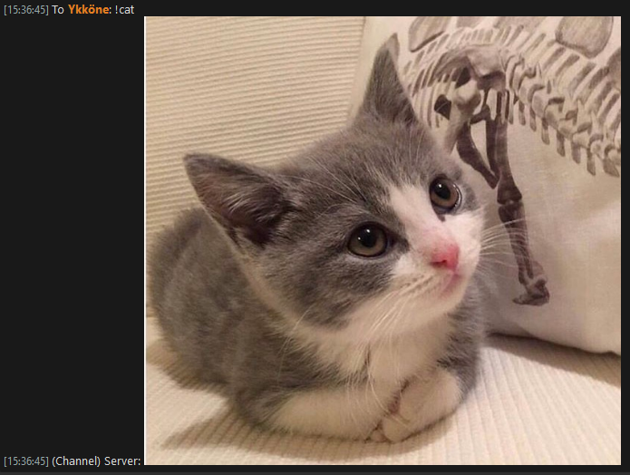

# randimg-mumo
Random image poster for murmur / mumo based on 'chatimg' module

Posts a random image from a configured folder based on a keyword given. Perfect for a shitposting mumble community.

Configurable keyword for a "true random" image within ALL keyword configured folders

## Folder structure
Keyword and image folder names should match. e.g.:

`keywords = rand, smug, cats`

Folders:

- (base directory)
  - **rand**
    - (images)
  - **smug**
    - (images)
  - **cats**
    - (images)
